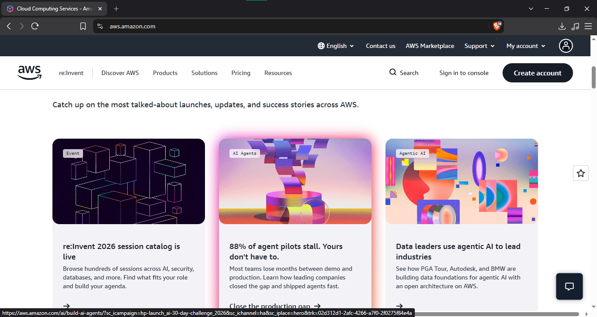

# Amazon Web Services (AWS)

## Brief Overview

Amazon Web Services (AWS) is a cloud computing platform provided by Amazon that offers services for computing, storage, databases, networking, security, and application development. It allows organizations to use cloud resources without needing to manage all physical hardware themselves.

## Global Infrastructure

AWS has a global infrastructure made up of **Regions and Availability Zones** located in different parts of the world. This allows applications and data to be deployed closer to users while improving performance, reliability, and availability.

## Cloud Management Console

The **AWS Management Console** is a web-based interface used to create, configure, monitor, and manage AWS resources and services. Users can access different AWS services from the console without needing to use command-line tools.

## Four Core Services

### 1. Amazon EC2

**Amazon Elastic Compute Cloud (EC2)** provides virtual servers that organizations can use to run applications and workloads in the cloud.

### 2. Amazon S3

**Amazon Simple Storage Service (S3)** is an object storage service used to store files, images, videos, backups, and other types of data.

### 3. Amazon VPC

**Amazon Virtual Private Cloud (VPC)** provides a private virtual network where AWS resources can be securely connected and managed.

### 4. AWS IAM

**AWS Identity and Access Management (IAM)** manages users, roles, permissions, and access to AWS resources. It helps organizations control who can access specific cloud services and resources.

## Three Advantages

### 1. Wide Range of Services

AWS provides many different cloud services for computing, storage, databases, networking, security, analytics, and application development.

### 2. Scalability

AWS allows organizations to increase or decrease cloud resources based on their needs. This helps businesses handle changes in workload and user demand.

### 3. Global Infrastructure

AWS provides infrastructure in different regions around the world, allowing organizations to deploy applications closer to their users and improve availability.

## Typical Enterprise Use Cases

AWS is commonly used for **web hosting, application development, data storage, database management, backup and recovery, and enterprise systems**. Organizations can use AWS to build scalable applications and manage their IT infrastructure in the cloud.

## Screenshot

