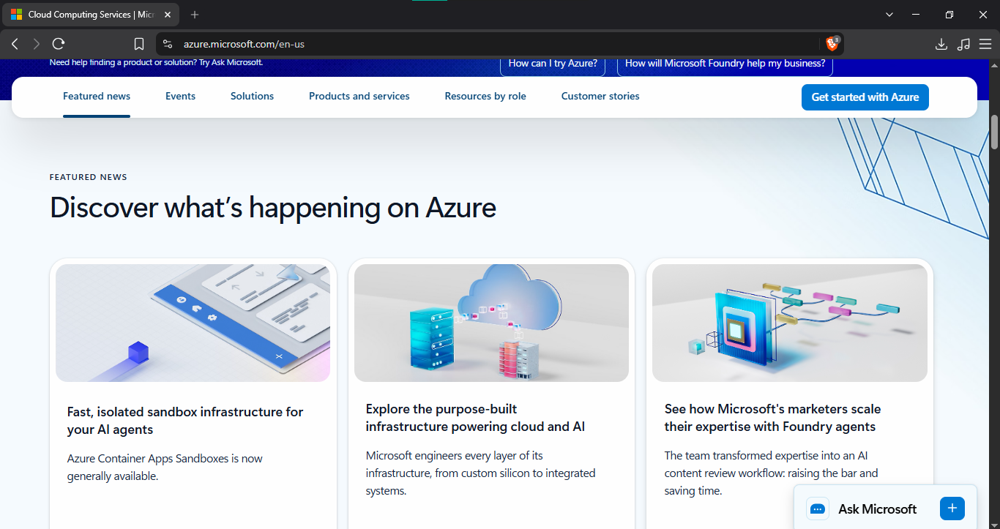

# Microsoft Azure

## Brief Overview

Microsoft Azure is a cloud computing platform provided by Microsoft that offers services for computing, storage, databases, networking, security, artificial intelligence, and application development. It helps organizations build, deploy, and manage applications and services using cloud resources.

## Global Infrastructure

Azure has a global infrastructure consisting of **Regions and Availability Zones** distributed across different locations. This helps organizations deploy applications closer to their users and improve performance, reliability, and availability.

## Cloud Management Console

The **Azure Portal** is a web-based interface used to create, configure, monitor, and manage Azure resources and services. It provides users with a centralized place to manage their cloud infrastructure and applications.

## Four Core Services

### 1. Azure Virtual Machines

**Azure Virtual Machines** provide virtual servers that can run applications and operating systems in the cloud. They can be used for Windows Server and Linux workloads.

### 2. Azure Blob Storage

**Azure Blob Storage** is an object storage service used to store large amounts of unstructured data such as documents, images, videos, and backups.

### 3. Azure Virtual Network

**Azure Virtual Network** provides a private network that allows Azure resources to communicate securely with each other and with other networks.

### 4. Microsoft Entra ID

**Microsoft Entra ID** is an identity and access management service that helps organizations manage users and control access to applications and cloud resources.

## Three Advantages

### 1. Microsoft Integration

Azure provides strong integration with Microsoft technologies such as **Windows Server, Microsoft 365, and Active Directory**. This makes it suitable for organizations that already use Microsoft products.

### 2. Scalability

Azure allows organizations to increase or decrease their cloud resources based on workload requirements. This helps applications handle changing numbers of users and requests.

### 3. Global Infrastructure

Azure has cloud infrastructure distributed across many locations around the world. This allows organizations to deploy services closer to their users and improve application availability.

## Typical Enterprise Use Cases

Azure is commonly used for **Windows Server migration, Microsoft application hosting, business applications, database management, cloud migration, and enterprise IT infrastructure**. It is especially useful for organizations that already depend on Microsoft technologies.

## Screenshot

