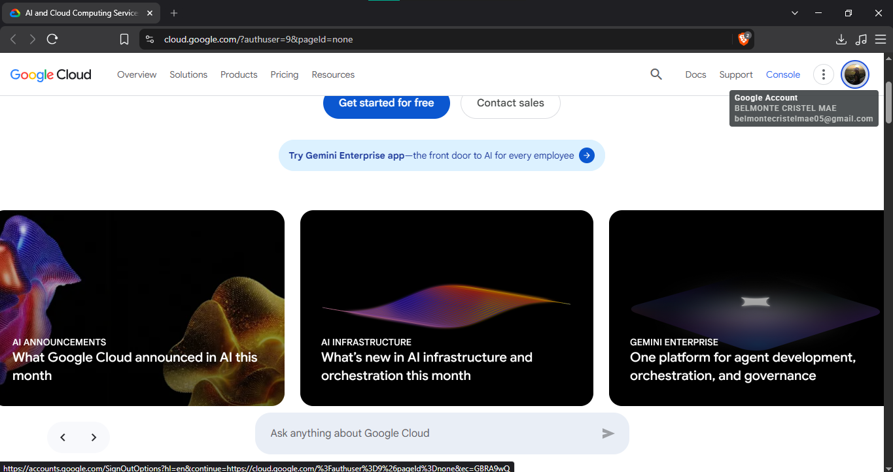

# Google Cloud Platform (GCP)

## Brief Overview

Google Cloud Platform (GCP) is a cloud computing platform provided by Google that offers services for computing, storage, databases, networking, artificial intelligence, machine learning, and data analytics. It provides cloud resources that organizations can use to develop, run, and manage applications.

## Global Infrastructure

GCP has a global infrastructure made up of **Regions and Zones** located in different parts of the world. This allows organizations to deploy applications and store data in suitable locations while improving performance, reliability, and availability.

## Cloud Management Console

The Google Cloud Console is a web-based management interface. It allows users to create, configure, monitor, and manage Google Cloud resources.

## Four Core Services

### 1. Compute Engine

Compute Engine provides virtual machines in the cloud. It can be used to run applications and other workloads.

### 2. Cloud Storage

Cloud Storage is an object storage service. It can store files, backups, media, and other types of data.

### 3. Virtual Private Cloud

Google Cloud VPC provides networking for cloud resources. It helps organizations connect and secure their applications.

### 4. Cloud Identity

Cloud Identity provides identity and access management. It helps organizations manage users and control access to resources.

## Three Advantages

### 1. Artificial Intelligence

Google Cloud provides strong artificial intelligence and machine learning services. These tools can support the development of AI applications.

### 2. Kubernetes

Google Cloud provides Google Kubernetes Engine (GKE). It helps organizations deploy and manage containerized applications.

### 3. Data Processing

Google Cloud provides services for data processing and analytics. These services can handle large amounts of data for different workloads.

## Typical Enterprise Use Cases

Google Cloud can be used for artificial intelligence and machine learning applications. It can also support data analytics, containerized applications, and high-performance workloads.

## Screenshot

