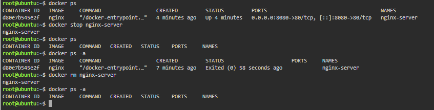

# Docker Deployment

## The Container Lifecycle

A Cloud-Native Engineer must know how to manage running containers. The following commands were used to list, stop, verify, and remove the Nginx container.

### 1. List Running Containers

```bash
docker ps
```

This command lists all currently running Docker containers and shows that the Nginx container is running.

### 2. Stop the Running Container

```bash
docker stop nginx-server
```

This command stops the running Nginx container.

### 3. Verify It Is Stopped

```bash
docker ps
```

This command verifies that the Nginx container is no longer running.

To view the stopped container:

```bash
docker ps -a
```

This command displays all containers, including stopped containers, and shows the Nginx container with an `Exited` status.

### 4. Remove the Container Completely

```bash
docker rm nginx-server
```

This command completely removes the stopped Nginx container.

### Verify Container Removal

```bash
docker ps -a
```

This command verifies that the Nginx container has been completely removed and no longer appears in the container list.

## Screenshot

### Container Lifecycle


