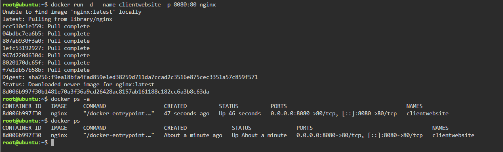
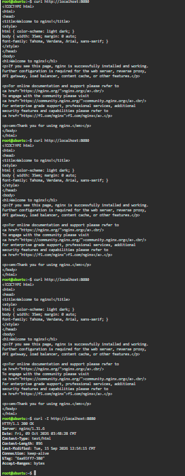
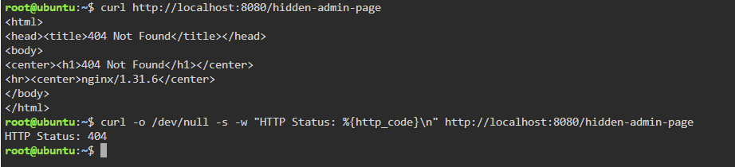
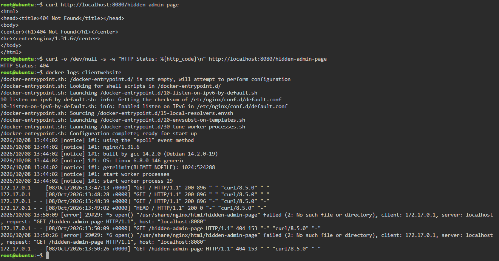

# Container Observability Report

## 1. Introduction

This report documents the deployment and monitoring of an Nginx container using Docker. I tested HTTP requests, inspected container logs, and monitored resource usage to understand the behavior and performance of the running container.

## 2. Container Deployment

### Docker Command

`docker run -d --name clientwebsite -p 8080:80 nginx`

### Explanation

- `docker run` creates and starts a container.
- `-d` runs the container in the background.
- `--name clientwebsite` assigns a name to the container.
- `-p 8080:80` maps host port 8080 to container port 80.
- `nginx` specifies the Docker image.

I verified that the container was running using `docker ps`.

### Screenshot

## 3. HTTP Request Simulation

I used the `curl` command to test the Nginx web server.

### Successful Request

Command used:

`curl -I http://localhost:8080`

The server returned HTTP 200 OK, indicating that the request was successful.

### Screenshot

### Missing Page Request

Command used:

`curl http://localhost:8080/hidden-admin-page`

To display only the HTTP status code, I also used:

`curl -o /dev/null -s -w "HTTP Status: %{http_code}\n" http://localhost:8080/hidden-admin-page`

The server returned HTTP Status 404 because the requested page did not exist.

### Screenshot

## 4. Log Analysis and Troubleshooting

### Command Used

`docker logs clientwebsite`

### Observations

- Nginx completed its startup process successfully.
- Requests to the root page returned HTTP 200.
- Requests to `/hidden-admin-page` returned HTTP 404.
- The error logs indicated that the requested file could not be found.
- The 404 response was expected because the requested page did not exist.

The logs helped me understand how Nginx handled successful and unsuccessful requests.

### Screenshot

## 5. Real-Time Container Metrics

### Command Used

`docker stats clientwebsite`

### Recorded Metrics

The following values were observed in the terminal screenshot.

- **Container Name:** clientwebsite
- **CPU Usage:** 0.00%
- **Memory Usage:** 2.781 MiB
- **Memory Limit:** 1.859 GiB
- **Memory Percentage:** 0.15%
- **Network I/O:** 4.97 kB / 6.46 kB
- **Block I/O:** 49.2 kB / 12.3 kB
- **PIDs:** 2

These values represent the container's resource usage at the time of the screenshot. They may change while the container is running.

### Screenshot

## 6. Findings

The Nginx container started successfully and responded to HTTP requests. The successful request returned HTTP 200, while the nonexistent page returned HTTP 404.

The container logs provided information about the requests and explained why the missing page could not be found. The `docker stats` command displayed resource usage, helping me understand how to monitor a running container.

## 7. Conclusion

This activity demonstrated how Docker logs and container metrics support application monitoring and troubleshooting. HTTP status codes helped identify the result of each request, while container metrics provided information about CPU, memory, and I/O usage.
