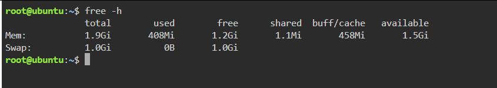
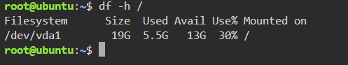

# System Baseline Report

## 1. Introduction

This report documents the system resource monitoring performed during Laboratory Activity 7. The purpose was to observe memory usage, disk space, CPU activity, and running processes before and during container deployment.

## 2. Memory Usage

### Command Used

`free -h`

### Results

- **Total Memory:** [Enter actual value]
- **Used Memory:** [Enter actual value]
- **Available Memory:** [Enter actual value]
- **Total Swap:** [Enter actual value]

### Screenshot

## 3. Disk Usage

### Command Used

`df -h /`

### Results

- **Filesystem:** [Enter actual filesystem]
- **Total Size:** [Enter actual value]
- **Used Space:** [Enter actual value]
- **Available Space:** [Enter actual value]
- **Usage Percentage:** [Enter actual percentage]

### Screenshot

## 4. CPU and Process Monitoring

### Command Used

`top`

The `top` command displays running processes, CPU activity, memory usage, and system load. I used this command to observe how system resources were being used.

### Observations

- The command displayed the running processes.
- CPU activity and memory usage were visible.
- The information helped me understand the current condition of the system.

## 5. Conclusion

System resource monitoring helps identify available memory and disk space before deploying applications. Monitoring CPU activity and running processes also helps administrators understand system performance and recognize possible resource limitations.
